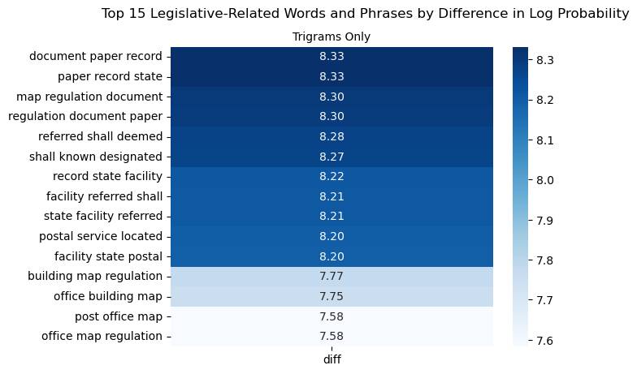

# Unitary Executive Theory of the Presidency

# 1. Background

The unitary executive theory of the presidency holds that the presidency is the end-all, be-all when it comes to executive power. Significantly, such a belief implies that Congress can and should have no say over agencies that it created; now that they exist, they are solely under the direction of the president. As a result, as some scholars have argued, the locus of legislation within the US government has shifted from Congress to the presidency. This trend is furthered by Congress' willing abdication of their legislative responsibility. The result, according to many, is the rise of an Imperial Presidency. 

Our question here will be whether and to what extent executive orders have become more legislative in nature. It is worth noting at the outset that the unitary executive theory has much broader implications -- in particular, we are likely to see legislation happening also at the agency-rulemaking-level, which would also fall under the purview of the president's authority, per the theory. Still, examining executive orders will give us a good start in examining the extent to which the presidency has garnered more legislative powers. 

To do so, we'll build an NLP model based upon all legislation from [THE PAST XXXX YEARS], and all executive orders since Franklin D. Roosevelt's presidency -- the point which many presidential scholars identify as the start of the modern presidency. We'll take legislation as our positive class -- our "1" -- in training our supervised model, and executive orders as our negative class -- our "0". We'll then see how well our model can categorize legislative versus executive documents, and whether it has become more difficult to separate the two over time -- as the unitary executive theory of the presidency would suggest. 

# 2. Data Understanding

The `executive_orders.csv` dataset includes the title, text, date of issue, and order numbers for all executive orders from March 8, 1933 (Order No. 6071) until October 30, 2023 (Order No. 14110). The dataset contains 2,253 total entries. The executive orders were largely collected from [Wikisource](https://en.wikisource.org/wiki/Category:United_States_executive_orders). The full code that was used to scrape Wikisource can be found in `wiki_scraping.ipynb`, inside the `notebooks` folder.

The `laws_cleaned.csv` contains legislation number, title, sponsor, date of introduction, and text for every public law from Congress beginning with the 113th Congress (2013-2015) until the 117th Congress (2021-2023). There are more than 1,300 entries in this dataset. These data were collected using congress.gov
The `laws_cleaned.csv` contains legislation number, title, sponsor, date of introduction, and text for every public law from Congress beginning with the 113th Congress (2013-2015) until the 117th Congress (2021-2023). There are more than 1,300 entries in this dataset. These data were collected using the official API of [congress.gov](https://www.congress.gov/). Documentation can be found [here](https://github.com/LibraryOfCongress/api.congress.gov). The full code used to pull these data can be found in `law_scraping.ipynb`, inside the `notebooks` folder.

# 3. Data Prep

A number of steps were required in order to make the text data of the executive orders and the laws machine readable:
1. All text was made lower-case; punctuation was removed.
2. The text was tokenized -- made into a list of individual words -- and stopwords (words with little to no semantic meaning, or that were removed for other reasons) were removed.
3. Each token was tagged according to its part of speech (PoS). Words were mapped as adjectives, nouns, verbs, or adverbs. From there, I then lemmatized the words, so that we just have the root word. This allows for easier comparison.

After this first cleaning, we can get a very basic look at the words we're dealing with by producing a couple of word clouds:

- NLP: cleaned and tokenized the text.
- Vectorizing to get relative word importance.

# 4. Modelling

- Started with relatively few stopwords
    - Ran three different models, all of which could easily predict whether a document was executive or legislative. 
    - We can maybe see a change in the ease with which something can be classified as legislation post-1970, but it's far from clear. 
    - Executive orders seem to rely much more on claims of authority an legitimacy; legislation much less so.

- Repeated with filtered stopwords. Getting rid of artefacts and authorization-related words.
    - Similar results.

- Even more restricted stopwords.

## 4.i Intiial Multinomial Naive Bayes

# 5. Conclusions and Next Steps

- Not clear, but the data certainly don't rule out the validity of the unitary executive theory of the presidency. To the extent that we can see anything, it would imply support.
- Need to repeat this with agency rule-making, although that will likely always be relatively legislative -- the question would be the relative influence that the President has over the direction of these rules, and that wouldn't necessarily or obviously be clear simply by analyzing the text, without adding the corresponding historical work.